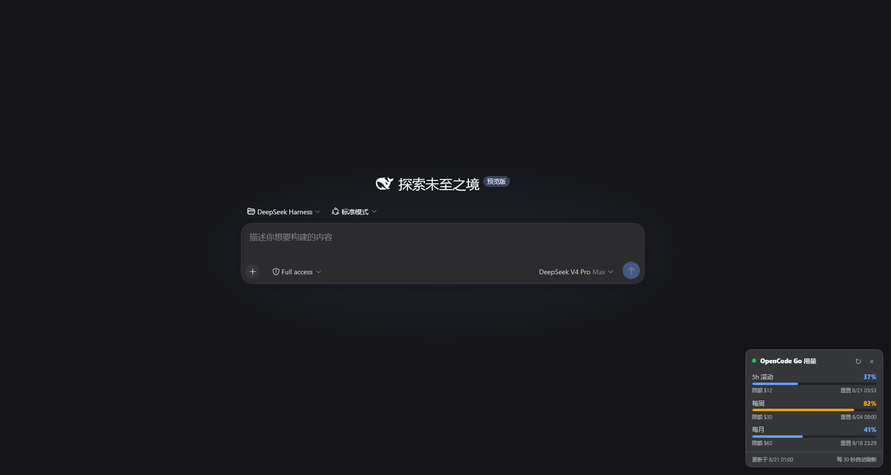

# dsh-opencode-go-usage

DeepSeek Harness Web GUI 插件：在**对话界面右下角常驻悬浮卡片**上实时显示 OpenCode Go 订阅用量（**5 小时滚动 / 每周 / 每月**），**每 30 秒自动刷新**，无需手动操作。

本项目是 [xiaoqi20/dsh-opencode-go-usage](https://github.com/xiaoqi20/dsh-opencode-go-usage)（设置页 + 手动刷新）的再开发版本。

## 功能

- 右下角悬浮卡片：三个用量窗口的百分比、进度条、限额与重置时间
- 每 30 秒自动刷新；页面底部显示"更新于"时间戳
- 可折叠为小胶囊（显示 5h 滚动百分比），点击展开
- 手动刷新按钮（↻）、错误状态友好提示 + 重试
- 用量 ≥80% 进度条变黄，≥100% 变红
- 中 / 英双语，跟随界面语言
- 自适应明暗主题

## 效果图



## 安装

```bash
# 1) 将插件链接进 web profile
dsh plugin --profile web add <本目录>

# 2) 在 $DSH_HOME/profiles/web/cordis.patch.yml 中加入一行
#    （顶层数组末尾追加 insert 条目）：
# - insert:
#     - id: opencode-go-usage
#       name: 'dsh-opencode-go-usage'

# 3) 重启 dsh web
```

重启后打开 Web UI，右下角即出现用量卡片，自动开始轮询。

## API Key 解析顺序

1. DSH 凭据 seam / 环境变量 `OPENCODE_GO_API_KEY`（`$DSH_HOME/.credentials.yaml`）
2. OpenCode `~/.local/share/opencode/auth.json` → `opencode-go`（回退 `opencode`）条目中 `type: "api"` 的 key

## 配置（可选）

在 profile 的 patch 层覆盖本行的 `config`（patch 会整体替换该行 config，需重述所有键）：

```yaml
- id: opencode-go-usage
  config:
    baseUrl: https://opencode.ai/zen/go/v1/usage   # 默认
    timeoutMs: 15000                                # 默认
```

## 接口

Host 注册同源只读路由 `GET /opencode-go-usage/status`，返回结构化 JSON（`configured` / `error` / `usage.rolling|weekly|monthly` / `fetchedAt`），带 5 秒内存缓存。**响应不含 API Key。**

用量接口 `GET https://opencode.ai/zen/go/v1/usage`（Bearer 认证）尚未写入 OpenCode 公开文档，响应结构可能变动；解析做了防御式处理。

## 架构说明

- Host 半 `index.js`：**零外部依赖**（仅 Node 内置模块 + `webServer`/`credentials` 服务），通过 `webServer.register` 提供状态路由；无论从哪个目录 link 安装都不会出现 peer 依赖解析失败。
- 浏览器半 `client.js`：自包含 lazy-CJS bundle（仅 `require('react')`），注册到 `shell.overlay` 全局悬浮层，通过 `fetch` 轮询状态路由。

## 许可证

MIT。再开发自 xiaoqi20/dsh-opencode-go-usage（MIT）。
