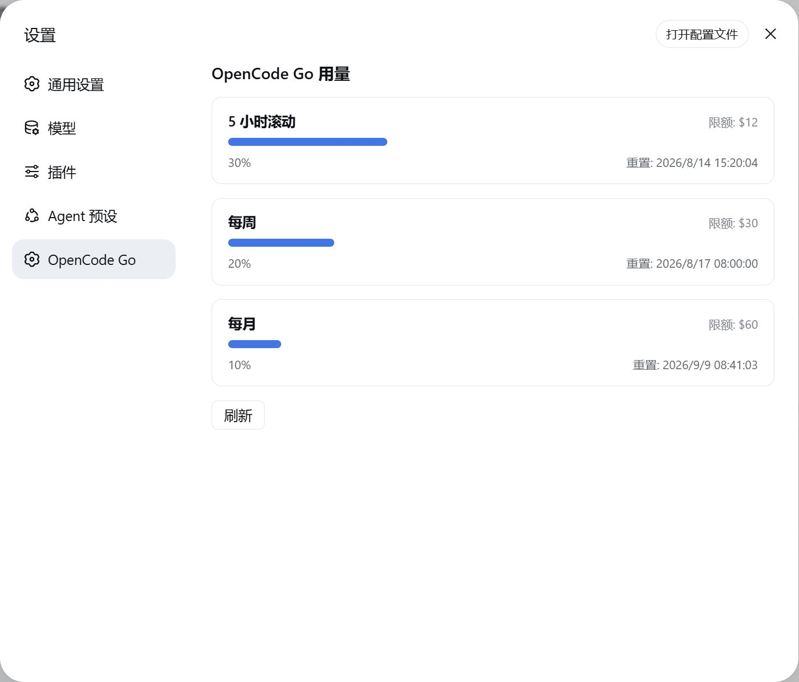

# dsh-opencode-go-usage

[English](README.md) | 中文

一个 [DeepSeek Harness](https://github.com/deepseek-ai/deepseek-harness) Web GUI 插件：在设置页侧边栏新增 **OpenCode Go** 入口，点击即可查看你 OpenCode Go 订阅的三个用量窗口 —— **5 小时滚动 / 每周 / 每月** —— 的已用百分比、消费限额与重置时间。

## 截图



## 功能

- 设置侧边栏新增 **「OpenCode Go」** 分区（`settings.section` 贡献）
- Host 端 Typert Remote `opencodeUsage/usage` 读取 API Key 并调用官方接口
- 客户端用量页：每个窗口的百分比、进度条、限额与重置时间
- 前置检查：若「设置 → 模型」未添加 opencode-go、或找不到 API Key，显示引导而非报错
- API Key 优先从 DSH 凭据 seam（`OPENCODE_GO_API_KEY`）解析，回退 OpenCode 的 `auth.json`

## 安装

```sh
dsh plugin --profile web add github:xiaoqi20/dsh-opencode-go-usage
```

在你的 profile patch 层（`$DSH_HOME/profiles/web/cordis.patch.yml`）加入插件行：

```yaml
- insert:
    - id: opencode-go-usage
      name: 'dsh-opencode-go-usage'
```

重启 `dsh web` 使 host 半与客户端 bundle 生效。插件依赖标准 web 组合（`api-gateway` 的 client Remote 与 `settings.section` 槽位），默认 `dsh web` profile 均已具备。

## 配置

Host 端参数写在 `cordis.yml` 的插件行上：

```yaml
- id: opencode-go-usage
  name: dsh-opencode-go-usage
  config:
    baseUrl: https://opencode.ai/zen/go/v1/usage   # 默认
    timeoutMs: 15000                                # 默认
```

| 键 | 默认值 | 含义 |
| --- | --- | --- |
| `baseUrl` | `https://opencode.ai/zen/go/v1/usage` | 用量接口地址。 |
| `timeoutMs` | `15000` | 请求超时（毫秒）。 |

## 用量接口

```http
GET https://opencode.ai/zen/go/v1/usage
Authorization: Bearer <API_KEY>
```

`<API_KEY>` 是 Anthropic 兼容的 OpenCode Go key（`sk-opencode-…`）。接口返回：

```json
{
  "usage": {
    "rolling": { "status": "ok", "percent": 9,  "resetsAt": "2026-08-14T07:20:04.810Z" },
    "weekly":  { "status": "ok", "percent": 12, "resetsAt": "2026-08-17T00:00:00.810Z" },
    "monthly": { "status": "ok", "percent": 6,  "resetsAt": "2026-09-09T00:41:03.810Z" }
  }
}
```

`percent` 为 0–100，`resetsAt` 为 ISO-8601。该接口尚未写入 OpenCode 公开文档。

## API Key 解析顺序

1. DSH 凭据 seam / 环境变量 `OPENCODE_GO_API_KEY`（`$DSH_HOME/.credentials.yaml`）
2. OpenCode `~/.local/share/opencode/auth.json` → `opencode-go`（回退 `opencode`）条目中 `type: "api"` 的 key

## 平台支持

**macOS、Linux、Windows 均可用**。插件是纯 ESM，无原生二进制、无构建步骤，Host 与 Client 两半都与平台无关。

| 平台 | API Key 解析 |
| --- | --- |
| macOS / Linux | ✅ `~/.local/share/opencode/auth.json` 正是 OpenCode CLI 的默认存储位置，开箱即用 |
| Windows | 建议用 `OPENCODE_GO_API_KEY`（凭据 seam 或环境变量）；相同相对位置存在 `auth.json` 时也会读取 |

任一平台的前置条件：Node.js + [DeepSeek Harness](https://github.com/deepseek-ai/deepseek-harness)，在「设置 → 模型」中配置 `opencode-go` 模型，以及一个 OpenCode Go API key。

## 工作原理

这是一个双面（Host + Client）插件。Host 发布 `opencodeUsage` Typert Remote 服务；Client 挂载它、注册 `settings.section` 并渲染页面；二者经 harness 的 `/api` RPC 传输通信。

| 文件 | 作用 |
| --- | --- |
| `index.js` | Host 半 —— `OpencodeUsageGateway`（`TypertRemoteService`，服务键 `opencodeUsage`） |
| `typert.host.js` | 手写 Typert 主机清单，经 `exports["./typert"]` 注册 |
| `client.js` | 浏览器 bundle（`window.__ModuleLoader__.load` 格式）—— 挂载 Remote、注册分区、渲染页面 |
| `package.json` | 双面声明：`main` + `exports["./client"]` + `exports["./typert"]` + `dsh.client` |

## 开发

插件为纯 ESM，无需构建步骤。Host 文件 import `@deepseek-ai/*` peer 依赖；客户端 bundle 手写为 harness 客户端加载器在 `/plugins` 下提供的 lazy-CJS 格式。

## 已知限制

- 用量接口未公开文档、可能变动；解析做了防御式处理，非 200 响应会显示友好状态而非崩溃。
- 限额（$12 / $30 / $60）仅作展示参考，不在接口返回中；它随 OpenCode Go 套餐变化，可能与实际不一致。

## 许可证

MIT

